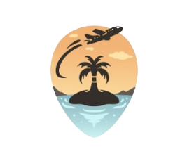

# 🌄 DanaTour: The Ascending Path

> **Experience the beauty of Danang through an immersive, AI-powered travel platform.**

 <!-- Placeholder for banner if available, using logo for now -->

## 📋 Project Overview

**DanaTour** is a next-generation travel booking platform designed to provide a seamless and visually stunning experience for travelers exploring Danang. Built with a "Mobile-First" and "UI/UX Pro Max" philosophy, the application combines modern web technologies with advanced design principles to create an interface that feels alive, responsive, and premiums.

The platform leverages **AI Agents** to offer personalized tour recommendations, ensuring every user finds their perfect journey.

## 🎨 UI/UX Design Intelligence

Our design system is built on the principles of **Immersion**, **Clarity**, and **Fluidity**.

### 1. Visual Language: "Oceanic Aurora"

The aesthetic is inspired by the coastal beauty of Danang—combining the depth of the ocean with the warmth of the sun.

- **Color Palette**:
  - 🔵 **Primary (Vivid Blue)**: `#2563eb` - Represents trust and the expansive sky.
  - 🌊 **Secondary (Sea Cyan)**: `#0891b2` - Evokes the refreshing coastal waters.
  - ✨ **Accent (Golden Ray)**: `#ffc857` - Captures the energy of sunshine and sandy beaches.
  - 🌿 **Nature (Emerald Green)**: `#10b981` - Symbolizes the lush mountains and forests.
  - 🌑 **Surface (Deep Navy)**: `#0f172a` - Used for high-contrast text and depth.
- **Gradients & Effects**:
  - **Aurora Gradients**: We utilize distinctive linear gradients (`bg-gradient-to-r from-primary to-sea`) on call-to-action buttons (Book Now) to create a sense of movement and fluidity.
  - **Glassmorphism**: The navigation and floating elements utilize `backdrop-filter: blur(24px)` with semi-transparent backgrounds (`bg-black/60`), ensuring content remains legible while maintaining context with the rich background visuals.

### 2. Typography: "Modern & Heritage"

A dual-font system that balances modern readability with character.

- **Headings / Display**: [**Be Vietnam Pro**](https://fonts.google.com/specimen/Be+Vietnam+Pro)
  - _Usage_: Used for all major headings and impactful statements. It visually connects the platform to its Vietnamese roots while maintaining a modern geometric feel.
- **Body / UI**: [**Noto Sans**](https://fonts.google.com/specimen/Noto+Sans)
  - _Usage_: Selected for its excellent legibility across all screen sizes and language support.

### 3. Motion Design: "Fluid Physics"

Motion is not just decoration; it is communication. We use **Framer Motion** to orchestrate interactions.

- **Library**: `framer-motion` (React), `lottie-react`
- **Micro-interactions**:
  - **Button Hover**: Elements lift (`translateY(-2px)`) and cast a glow (`shadow-lg`) to encourage clicking.
  - **Scroll Reveal**: Sections fade in and slide up as the user explores the page, creating a narrative flow.
  - **Page Transitions**: Smooth opacity and position transitions prevent jarring context switches.
  - **AnimatePresence**: Used for modals and mobile menus to ensure exit animations are as smooth as entry ones.

## 🛠️ Technology Stack

### Core Framework

- **Runtime**: [React 19](https://react.dev/) - The latest standard for building interactive UIs.
- **Build Tool**: [Vite](https://vitejs.dev/) - Blazing fast HMR and build performance.
- **Language**: [TypeScript](https://www.typescriptlang.org/) - Ensuring type safety and code scalability.

### Styling & UI

- **Tailwind CSS**: Utility-first CSS for rapid layout and responsive design.
- **CSS Modules/Variables**: Custom `index.css` for complex gradients and theme variables.
- **Icons**: [Lucide React](https://lucide.dev/) - A consistent, clean icon set.
- **Animations**:
  - **Framer Motion**: For state transitions and physics-based interactions.
  - **Lottie React**: High-quality, illustrative vector animations used for complex storytelling (e.g., About page visuals, Feature highlights).

### Integration

- **Generative AI**: Google Generative AI SDK for intelligent itinerary processing.

## 🚀 Getting Started

Follow these steps to set up the project locally.

### Prerequisites

- Node.js (v18 or higher)
- npm or yarn

### Installation

1.  **Clone the repository**

    ```bash
    git clone https://github.com/your-username/danatour-fe.git
    cd danatour-fe
    ```

2.  **Install dependencies**

    ```bash
    npm install
    ```

3.  **Run the development server**

    ```bash
    npm run dev
    ```

4.  **Open your browser**
    Navigate to `http://localhost:5173` to view the application.

## 📦 Project Structure

```bash
danatour-fe/
├── components/       # Reusable UI components (Header, Cards, Buttons)
├── pages/           # Route components (Home, TourDetail, Login)
├── public/          # Static assets (Images, Icons)
├── services/        # API integrations and AI services
├── App.tsx          # Main application component with Routing
└── index.css        # Global styles and Design System variables
```

---

_Designed with ❤️ for Danang Tourism._
