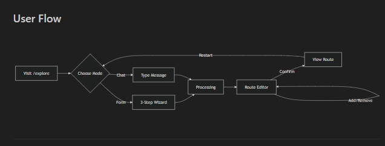

# Tính năng AI Cá nhân hóa Lộ trình

## Những gì đã được triển khai

Trang Đà Nẵng Explore đã được chuyển đổi thành trải nghiệm cá nhân hóa dựa trên AI:

- **Hai chế độ nhập liệu**: Form (wizard 3 bước) hoặc Chat (ngôn ngữ tự nhiên NLP)
- **Tạo lộ trình AI**: Lọc địa điểm dựa trên sở thích
- **Trình chỉnh sửa lộ trình**: Thêm/xóa các chặng sau khi tạo _(MỚI)_
- **Hiển thị lộ trình cá nhân hóa**: Bản đồ tương tác dựa trên cuộn trang

---

## Luồng người dùng (User Flow)



---

## AI Workflow Pipeline

```mermaid
flowchart TB
    subgraph INPUT ["📥 Đầu vào"]
        A1[Form Input] --> B[Preferences Object]
        A2[Chat Input] --> C[NLP Parser]
        C --> B
    end

    subgraph PROCESSING ["⚙️ Xử lý AI"]
        B --> D[Filter Locations]
        D --> E[Rank by Relevance]
        E --> F[Apply Duration Limit]
        F --> G[Generate Explanation]
    end

    subgraph OUTPUT ["📤 Đầu ra"]
        G --> H[AI Recommendation]
        H --> I[locations: LocationData[]]
        H --> J[explanation: string]
        H --> K[estimatedTime: string]
    end

    subgraph EDITING ["✏️ Chỉnh sửa"]
        I --> L[Route Editor]
        L --> M{User Action}
        M -->|Thêm| N[Add Checkpoint]
        M -->|Xóa| O[Remove Checkpoint]
        N --> L
        O --> L
        M -->|Xác nhận| P[Final Route]
    end

    style INPUT fill:#1a365d,stroke:#4FD1C5
    style PROCESSING fill:#322659,stroke:#D946EF
    style OUTPUT fill:#744210,stroke:#FFC857
    style EDITING fill:#1c4532,stroke:#22C55E
```

---

## Chi tiết Pipeline

### 1. Giai đoạn Đầu vào (Input Stage)

| Chế độ   | Mô tả                                                      |
| -------- | ---------------------------------------------------------- |
| **Form** | Người dùng chọn trực tiếp: Travel Style → Zones → Duration |
| **Chat** | Tin nhắn tự nhiên → NLP Parser trích xuất preferences      |

### 2. Giai đoạn Xử lý (Processing Stage)

```
Preferences → Filter → Rank → Limit → Explain
```

- **Filter Locations**: Lọc địa điểm theo zone và travel style
- **Rank by Relevance**: Xếp hạng dựa trên điểm phù hợp với style
- **Apply Duration Limit**: Giới hạn số checkpoint theo thời lượng
- **Generate Explanation**: Tạo văn bản giải thích lộ trình

### 3. Giai đoạn Đầu ra (Output Stage)

```typescript
interface AIRecommendation {
  locations: LocationData[]; // Danh sách địa điểm
  explanation: string; // Giải thích của AI
  estimatedTime: string; // Thời gian ước tính
}
```

### 4. Giai đoạn Chỉnh sửa (Editing Stage)

- Người dùng có thể **thêm/xóa** checkpoint
- Xác nhận để xem lộ trình cuối cùng

---

## Các file đã tạo/chỉnh sửa

| File                                 | Mục đích                                          |
| ------------------------------------ | ------------------------------------------------- |
| `components/RouteEditor.tsx`         | **MỚI** - Thêm/xóa các chặng sau khi tạo lộ trình |
| `services/mockAIService.ts`          | Phân tích NLP + tạo lộ trình                      |
| `components/AIInputForm.tsx`         | Form hai chế độ (Form/Chat)                       |
| `components/AIProcessingOverlay.tsx` | Màn hình loading với hiệu ứng Aurora              |
| `pages/DaNangExplore.tsx`            | Luồng 4 trạng thái: form→processing→editing→route |

---

## Tính năng Trình chỉnh sửa lộ trình

- Xem tất cả các chặng do AI tạo trong danh sách
- **Xóa**: Di chuột vào và nhấp icon thùng rác
- **Thêm**: Nhấp "Add Checkpoint" để xem các điểm đến có sẵn
- Hiển thị số lượng chặng và thời gian ước tính
- **Xác nhận**: Hoàn tất lộ trình và xem trên bản đồ

---

## Hướng dẫn kiểm thử

1. Truy cập: `http://localhost:3000/explore`
2. Chọn chế độ: Form hoặc Chat AI
3. Hoàn thành nhập liệu → AI tạo lộ trình
4. **Trình chỉnh sửa lộ trình**:
   - Xóa các chặng không mong muốn
   - Thêm điểm đến mới từ danh sách có sẵn
5. Nhấp **Xác nhận** → Xem lộ trình cá nhân hóa

---

## Từ khóa NLP hỗ trợ

### Phong cách du lịch

| Phong cách  | Từ khóa tiếng Anh                    | Từ khóa tiếng Việt               |
| ----------- | ------------------------------------ | -------------------------------- |
| Adventure   | adventure, exciting, explore, hiking | mạo hiểm, phiêu lưu, khám phá    |
| Relaxation  | relax, peaceful, chill, spa          | thư giãn, nghỉ ngơi, yên bình    |
| Culture     | culture, history, temple, museum     | văn hóa, lịch sử, chùa, bảo tàng |
| Photography | photo, instagram, sunset, scenic     | chụp ảnh, cảnh đẹp               |
| Food        | food, cuisine, restaurant, seafood   | ẩm thực, ăn uống, đặc sản        |

### Khu vực

| Khu vực   | Từ khóa tiếng Anh        | Từ khóa tiếng Việt        |
| --------- | ------------------------ | ------------------------- |
| Biển      | beach, sea, ocean, coast | biển, bờ biển             |
| Thành phố | city, urban, downtown    | thành phố, trung tâm, phố |
| Núi       | mountain, hill, nature   | núi, đồi, thiên nhiên     |

### Thời lượng

| Thời lượng | Từ khóa tiếng Anh            | Từ khóa tiếng Việt              |
| ---------- | ---------------------------- | ------------------------------- |
| Nửa ngày   | half day, morning, afternoon | nửa ngày, buổi sáng, buổi chiều |
| Cả ngày    | full day, whole day, one day | cả ngày, một ngày               |
| 2 ngày     | 2 days, weekend              | 2 ngày, cuối tuần               |

---

> ⚠️ **LƯU Ý**: Đang sử dụng mock NLP. Thay thế `mockAIService.ts` bằng tích hợp backend khi sẵn sàng.
